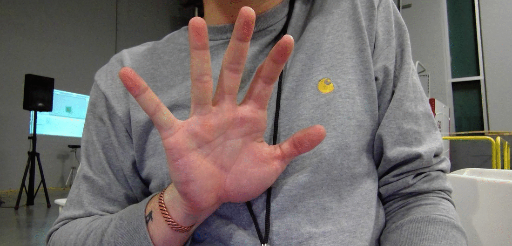
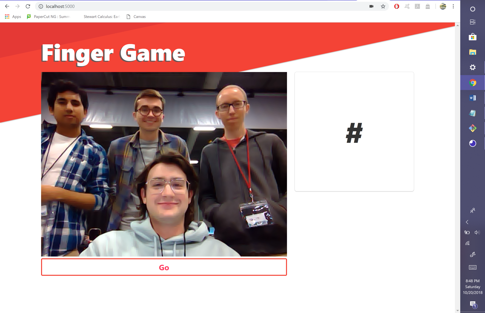

# Finger Game

Finger Game is a simple web application/game that utilizes self-trained object detection and the Flask microframework to create a quirky, yet uniquely fun **HackISU Fall 2018 project**. The goal was to create an interactive web based game that utilized some type of machine learning in python. 

## Machine Learning

The data we collected ourself simply with our webcams. Together we collected 92 images for training. Obviously 92 images ins't enough so we utilized the [imgaug](https://github.com/aleju/imgaug) library and some math to augment and differentiate our training data in many different ways. We trained our finger-tip detector using [darknet](https://github.com/pjreddie/darknet) and a yolo tiny model. We implemented the yolo network with this [PyTorch implementation](https://github.com/ayooshkathuria/pytorch-yolo-v3).

## User Interface

### Technology

- Flask (to serve the static files)
- JavaScript
- The [Bulma](https://bulma.io/) CSS framework

The game logic resides in `app/static/script.js`. Using the Media Capture and Streams API, we obtain permission from the user to capture data from the user's webcam. Then, with the MediaStream Image Capture API, we send images of the webcam feed at a regular interval to the Flask application on the server. After performing the image processing, it returns the number of finger tips in the image to the client. If the response matches the randomly generated number on the client side, the game advances to the next round.

