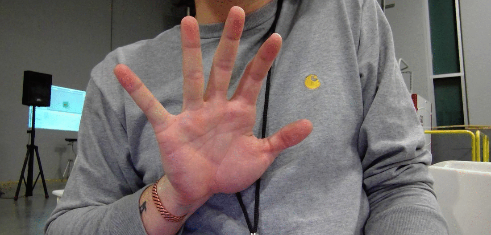

# Finger Game

Finger Game is a simple web application/game that utilizes self-trained object detection and a flask front end to create a quirky, yet uniquely fun **HackISU Fall 2018 project**. The goal was to create an interactive web based game that utilized some type of machine learning in python. 

The data we collected ourself simply with our webcams. Together we collected 92 images for training. Obviously 92 images ins't enough so we utilized the [imgaug](https://github.com/aleju/imgaug) library and some math to augment and differentiate our training data in many different ways. We trained our finger-tip detector using [darknet](https://github.com/pjreddie/darknet) and a yolo tiny model. We implemented the yolo network with this [PyTorch implementation](https://github.com/ayooshkathuria/pytorch-yolo-v3).

